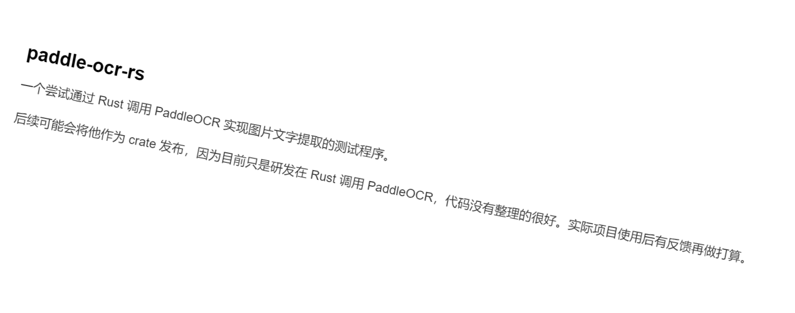

[简体中文](./docs/README_zh-Hans.md)

## paddle-ocr-rs

A test program attempting to extract text from images by calling PaddleOCR through Rust.

It may be published as a crate in the future, as it's currently just researching how to call PaddleOCR from Rust. The code is not well-organized yet. Future plans will be determined based on feedback from actual project usage.

#### Development Environment

| Dependency | Version |
|------------|-----------------------------|
| rustc | 1.84.1 (e71f9a9a9 2025-01-27) |
| cargo | 1.84.1 (66221abde 2024-11-19) |
| OpenCV | 4.11.0 |
| OS | Windows 11 24H2 |
| Paddle OCR | 4 |

#### Model Source

[RapidOCR Docs](https://rapidai.github.io/RapidOCRDocs/main/model_list/)

#### Related Information

This project can be considered a Rust implementation of RapidOCR, with code referenced from RapidOCR's C++ implementations.

C++ implementation: [RapidOcrOnnx](https://github.com/RapidAI/RapidOcrOnnx)

One tricky point is that the project uses OpenCV for image processing, so an OpenCV environment needs to be provided.

The OpenCV crate is [opencv-rust](https://github.com/twistedfall/opencv-rust), and installation dependencies are described in the README: [INSTALL.md](https://github.com/twistedfall/opencv-rust/blob/master/INSTALL.md)

Note that the DLL named opencv_worldxxxx.dll needs to be placed in the ./target/debug directory. This is mentioned in the opencv-rust documentation, so I won't elaborate further here.

#### Demo Results

#### test_1.png



```bash
paddle-ocr-rs
~个尝试通过Rust 调用PaddleOCR 实现图片文字提取的测试程序。
后续可能会将他作为 crate 发布，因为目前只是研发在 Rust 调用 PaddleOCR，代码没有整理的很好。实际项目使用后有反馈再做打算。
```

#### test_2.png


```bash
母婴用品连
锁
```

#### Output Preview

##### test_1.png

```bash
keys Size = 6625
=====Start detect=====
---------- step: dbNet getTextBoxes ----------
TextBoxesSize(3)
TextBox { points: [Point { x: 102, y: 131 }, Point { x: 334, y: 177 }, Point { x: 327, y: 219 }, Point { x: 94, y: 174 }], score: 0.8739496 }
TextBox { points: [Point { x: 90, y: 197 }, Point { x: 796, y: 333 }, Point { x: 790, y: 369 }, Point { x: 84, y: 233 }], score: 0.8564408 }
TextBox { points: [Point { x: 77, y: 257 }, Point { x: 1478, y: 527 }, Point { x: 1472, y: 564 }, Point { x: 70, y: 294 }], score: 0.8536175 }
---------- step: drawTextBoxes ----------
---------- step: angleNet getAngles ----------
AnglesSize(3)
Angle { index: 0, score: 1.0, time: 15.0 }
Angle { index: 0, score: 0.6775721, time: 14.0 }
Angle { index: 0, score: 0.9986754, time: 13.0 }
---------- step: crnnNet getTextLines ----------
paddle-ocr-rs
~个尝试通过Rust 调用PaddleOCR 实现图片文字提取的测试程序。
后续可能会将他作为 crate 发布，因为目前只是研发在 Rust 调用 PaddleOCR，代码没有整理的很好。实际项目使用后有反馈再做打算。
```
